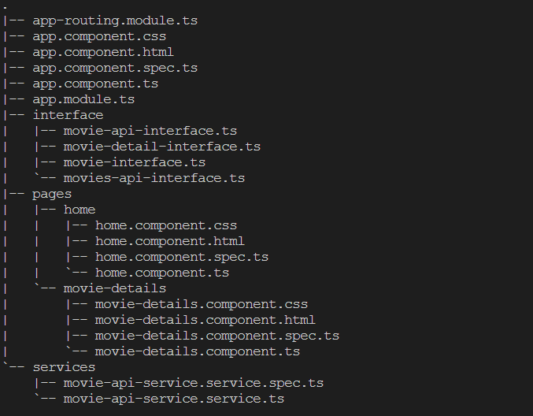

## Movie App Frontend

**This app is frontend of the movie app which shows all the trending movie and thier basic details which includes trailer, movie poster, movie name, movie description, movie release date and genre.**

#### Technology Used
1. **Angular** : This frontend frameword is used to enable high performance and seemless experience across all the browser versions. 
2. **Bootstrap** : This CSS library is used to use style in components.

#### Folder Structure

 ##### App is divided into folders like interfaces, pages, services. 
 1. Interfaces have all the interfaces used in this app
 2. Pages have all the page component used in this app
 3. Services have all the services used in this app
 4. App component is the main component in which we are using angular router to route through different pages

#### Project Setup
1. Clone this repo.
2. Add the backend url in the src/app/servies/movie-api-service.service.ts in the base Url variable.
3. run the repo by the command ng serve.

#### Thought Process involved while making this app
1. We have to make a app to show all the movie titles and show some details in a popup screen to solve this. I have fetched all the movie list with minimal details and then then i have done another api request to fetch the movie poster of each movie.
2. I have used Bootstrap as my css library because is very simple and effective and lightwieght and gives all the styled component i needed.
3. I have used Bootstrap card to show cards of the movie.
4. I have used Bootstrap modal to show the popup screen of the movie.
5. I have used react router to switch between different pages as the application requires two pages which is home and movie detail page.
6. for the movie detail page I have requested the api to fetch all the movie details.
7. To embed a youtube trailer video we have to sanitize the url so as to make this url safe to play so I have used Angular DomSanitizer to do that.
8. I have autoplay the youtube video by adding autoplay prop to youtube iframe.

#### Future improvements
1. We can add pagination as when the movie data is very large and its not efficient to fetch all the data which we dont need to show on the screen.
